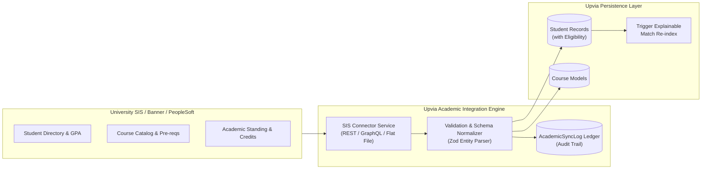

# Upvia Academic SIS Integration Architecture

## Overview

Upvia is designed to sit alongside existing higher education enterprise resource planning (ERP) and Student Information Systems (SIS)—such as **Ellucian Banner**, **Oracle PeopleSoft Campus Solutions**, and **Workday Student**.

The academic synchronization engine provides an idempotent, fault-tolerant ingestion pipeline that keeps student records, academic standings, and course catalogs synchronized without manual data re-entry.

---

## Architecture of Academic Integration



---

## Pluggable Service Abstraction

The integration engine is defined by the `AcademicIntegrationService` abstract interface in `backend/src/modules/academic-sync/`:

```typescript
export interface AcademicIntegrationService {
  syncStudents(universityId: string, options?: SyncOptions): Promise<SyncResult>;
  syncCourses(universityId: string, options?: SyncOptions): Promise<SyncResult>;
  syncDegreesAndPrograms(universityId: string): Promise<SyncResult>;
  getSyncHistory(universityId: string): Promise<IAcademicSyncLogDocument[]>;
}
```

---

## Idempotent Ingestion & Upsert Strategy

To guarantee data integrity across repeated sync executions:
1. **Natural Key Resolution**:
   - Students are keyed by institutional `studentIdNumber` (e.g. `202010480`).
   - Courses are keyed by institutional `code` (e.g. `SWE-363`).
   - Programs are keyed by degree code (e.g. `BS-SWE`).
2. **Atomic Mongoose Upserts**:
   ```typescript
   await Student.findOneAndUpdate(
     { studentIdNumber: record.studentIdNumber },
     {
       $set: {
         gpa: record.gpa,
         completedCredits: record.completedCredits,
         academicStanding: record.academicStanding,
         trainingEligibility: record.completedCredits >= 90 ? 'ELIGIBLE' : 'NOT_ELIGIBLE',
         lastSyncedAt: new Date()
       }
     },
     { upsert: true, new: true }
   );
   ```

3. **Fault-Tolerant Batch Processing**: If individual records fail validation (e.g. malformed GPA or unknown major code), the pipeline records the specific anomaly in `syncErrors`, isolates the row, and continues ingesting the remaining cohort.

---

## Co-op Eligibility Calculation

During synchronization, Upvia dynamically computes each student's `trainingEligibility` status:
- **`NOT_ELIGIBLE`**: Less than 90 completed credit hours or GPA below departmental minimum (e.g. `< 2.00`).
- **`ELIGIBLE`**: Senior standing ($\ge 90$ credit hours), Good Standing, no academic sanctions.
- **`IN_TRAINING`**: Currently placed in an approved active co-op placement.
- **`COMPLETED`**: Successfully finished co-op placement hours and passed evaluation.

---

## Audit & Verification Ledger

Every synchronization run produces an immutable record in the `academic_sync_logs` collection containing:
- `syncType`: `STUDENTS`, `COURSES`, `PROGRAMS`, or `FULL`
- `recordsProcessed`: Total count received from SIS
- `recordsFailed`: Anomaly count
- `syncErrors`: Detailed stack traces or field-level validation errors
- `executionTimeMs`: Processing latency
