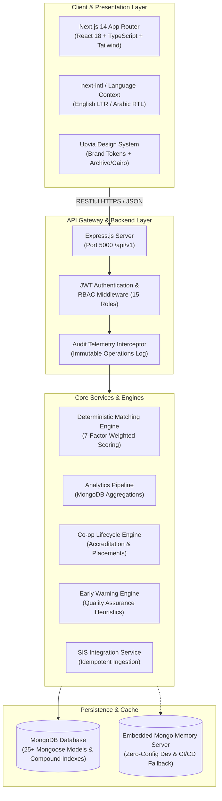

# Upvia Platform Architecture

## Executive Overview

**Upvia** is an enterprise-grade university employability, cooperative training, career management, opportunity matching, graduate tracking, skills-gap analysis, and labor-market intelligence platform.

Built from first principles as a production monorepo, Upvia bridges higher education institutions and the industrial labor market through auditable workflows, explainable deterministic matching, and longitudinal employment tracking.

---

## Architectural Principles

1. **Clean Layered Separation**: The backend follows a strict separation of concerns:
   - **Routes / API Layer**: Express routers declaring endpoints, HTTP methods, and parameter extraction.
   - **Security / Middleware**: JWT verification, fine-grained RBAC across 15 institutional roles, and Zod payload validation.
   - **Controllers**: HTTP request orchestration, parameter transformation, and structured JSON formatting.
   - **Services / Business Logic**: Pure domain operations, explainable matching algorithms, and aggregation pipelines.
   - **Data Access / Models**: Mongoose schemas with compound indexes, validators, and referential relationships.

2. **Zero Mock Commitment**: Every metric, status transition, match score, and analytics chart is computed in real-time from underlying MongoDB collections.

3. **Multi-Stakeholder Federation**: Unified data models securely partition data access across four key user domains:
   - **University Leadership & Academic Units**: Deans, department heads, program coordinators, and career counselors.
   - **Co-op Training Units**: Institutional internship administrators and academic advisors.
   - **Industrial Employers**: Corporate recruiters, hiring managers, and field supervisors.
   - **Students & Graduates**: Active job seekers, enrolled co-op trainees, and tracked alumni.

4. **Bilingual & Culturally Native**: Deep first-class support for English (LTR) and Arabic (RTL) across UI, typography (Archivo and Cairo), and localized database schema properties (`nameEn` / `nameAr`).

---

## System Architecture Diagram



---

## Monorepo Structure

The Upvia codebase is structured as a clean TypeScript monorepo with dedicated workspaces:

```
upvia/
├── package.json               # Monorepo root workspace configuration
├── docker-compose.yml         # Container orchestration (App, DB, Cache)
├── docs/                      # Enterprise system documentation
│   ├── architecture.md
│   ├── database.md
│   ├── api.md
│   ├── authentication.md
│   ├── authorization.md
│   ├── matching-engine.md
│   ├── training-workflow.md
│   ├── analytics.md
│   ├── deployment.md
│   └── academic-integration.md
├── shared/                    # Core shared domain package (@upvia/shared)
│   ├── package.json
│   ├── tsconfig.json
│   └── src/
│       ├── constants/         # Brand tokens, roles, statuses, scoring weights
│       ├── types/             # Domain entity interfaces & API contracts
│       └── index.ts
├── backend/                   # Node.js + Express.js + Mongoose REST API
│   ├── Dockerfile
│   ├── tsconfig.json
│   ├── jest.config.js
│   └── src/
│       ├── server.ts          # Application entrypoint & route registration
│       ├── config/            # DB connection & environment configuration
│       ├── middleware/        # Auth, RBAC, error handling, validation
│       ├── utils/             # JWT, password hashing, audit, response helpers
│       ├── models/            # 25+ Mongoose models with compound indexes
│       ├── modules/           # Feature modules (controllers, services, routes)
│       └── seed/              # Institutional seed dataset
└── frontend/                  # Next.js 14 App Router + Tailwind CSS Web Portal
    ├── Dockerfile
    ├── tsconfig.json
    ├── tailwind.config.ts     # Brand palette & typography
    ├── messages/              # Bilingual dictionaries (en.json, ar.json)
    ├── lib/                   # API client, auth context, i18n context
    ├── components/            # Brand mark, layout, AppShell, UI components
    └── app/                   # App Router pages (Public, Student, Company, Admin)
```

---

## Component Interactions & Data Flow

### 1. Cooperative Opportunity Accreditation Flow
```
Industrial Partner -> Submits Opportunity -> Program Coordinator Validates Academic Alignment -> Training Unit Grants Accreditation -> Opportunity Published to Qualified Students
```

### 2. Opportunity Application & Deterministic Matching Flow
```
Student Browses -> Matching Engine Runs 7-Factor Weighted Scoring against Student Profile -> Detailed Breakdown & Missing Prerequisites Computed -> Student Submits Application -> Company Reviews Applications -> Company Schedules Technical / HR Interview -> Company Extends Co-op Offer -> Student Accepts -> Training Placement Activated
```

### 3. Co-op Training Supervision & Milestone Flow
```
Active Training Placement -> Weekly Attendance Check-ins (Geo-coded/Timestamped) -> Task & Milestone Submissions -> Periodic Student Learning Reports -> Field Supervisor 10-Dimension Evaluation -> Student 7-Dimension Company Feedback -> University Final Co-op Grade Assigned
```

### 4. Post-Training Employment & Alumni Tracking Flow
```
Successful Training -> Company Issues Post-Coop Job Offer -> Student Accepts -> Student Transitions to Graduate Status -> Longitudinal Graduate Tracking at 3, 6, 12, 24 Months -> Institutional Analytics & Skill Gap Dashboards Updated in Real-Time
```

---

## Brand Guidelines & Design Tokens

Upvia utilizes a clean, institutional design system engineered for clarity, accessibility, and high executive readability:

- **Color Hierarchy**:
  - **70% Base Surface**: Crisp White (`#FFFFFF`) and Neutral Mist (`#F1F5F9`).
  - **20% Institutional Navy**: Deep Anchor Navy (`#0B1B3A`) for navigation sidebars, typography headers, and primary authority surfaces.
  - **10% Kinetic Cyan-Blue**: Action Royal Blue (`#1A56DB`) and Vivid Accent Cyan (`#22D3EE`) for active states, CTA buttons, metrics callouts, and match score indicators.
- **Logotype Mark**: An abstract geometric `U` monogram featuring an angled, rising right stroke set at 45 degrees, symbolizing upward mobility and career advancement.
- **Typography**:
  - Latin: `Archivo` font family (Weights: 300, 400, 600, 700, 800).
  - Arabic: `Cairo` font family (Weights: 300, 400, 600, 700, 800).
