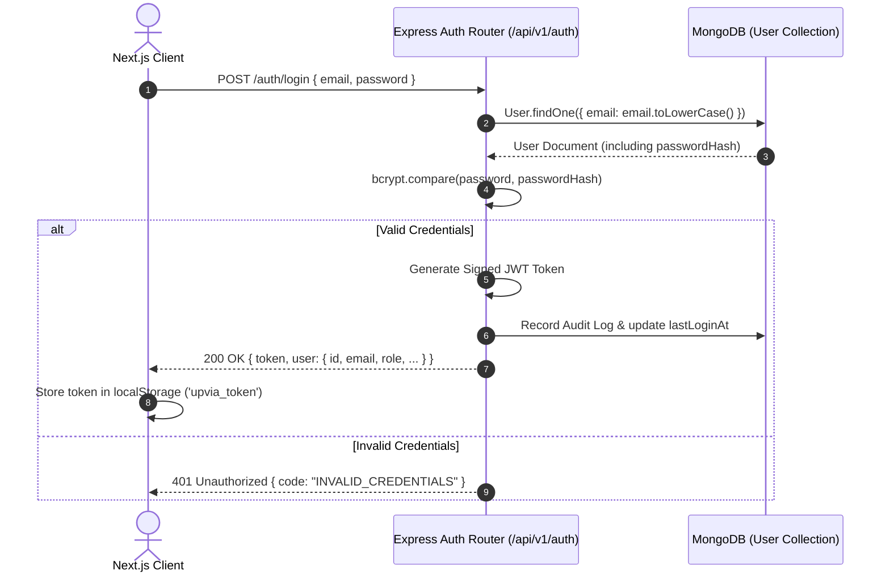

# Upvia Authentication Architecture

## Overview

Upvia implements a secure, stateless, JSON Web Token (JWT) authentication system designed to handle multi-stakeholder identity across academic institutions, corporate partners, and students.

---

## Authentication Mechanism



---

## Token Specifications

- **Algorithm**: `HS256` (HMAC with SHA-256)
- **Header**:
  ```json
  {
    "alg": "HS256",
    "typ": "JWT"
  }
  ```
- **Payload Structure**:
  ```json
  {
    "userId": "66e2c3...",
    "email": "student@upvia.com",
    "role": "STUDENT",
    "universityId": "66e2b...",
    "companyId": null,
    "iat": 1726084000,
    "exp": 1726688800
  }
  ```

---

## Password Security

1. **Hashing Engine**: `bcryptjs` with salt work factor of `12`.
2. **Timing Attack Protection**: Passwords are verified using constant-time string comparison in bcrypt.
3. **Redaction**: Mongoose schema projections explicitly exclude `passwordHash` by default:
   ```typescript
   user.toObject();
   delete user.passwordHash;
   ```

---

## Demo Accounts & Test Credentials

For rapid institutional evaluation and demonstration, Upvia includes pre-seeded demo accounts for every operational persona.

| Operational Role | Demo Email | Password |
|---|---|---|
| **Student** | `student@upvia.com` | `Password123!` |
| **University Leadership** | `leadership@upvia.com` | `Password123!` |
| **Program Coordinator (SE)** | `coordinator.se@upvia.com` | `Password123!` |
| **Training Unit Head** | `training.unit@upvia.com` | `Password123!` |
| **Company Admin (Aramco)** | `company.admin@upvia.com` | `Password123!` |
| **Company Supervisor** | `supervisor@upvia.com` | `Password123!` |

> **Interactive Role Switcher**:
> The Upvia UI includes a floating demo role switcher on the login page (`/login`) and navigation header, allowing evaluators to instantaneously switch perspectives without manually logging in and out.

---

## Client Session Management

1. **Token Persistence**: Stored client-side in `localStorage` under `upvia_token`.
2. **Automatic Session Hydration**: On initial application mount, the frontend queries `GET /api/v1/auth/me` with the stored token. If valid, user state is populated in `AuthContext`.
3. **Graceful Expiration**: If an API request returns `401 Unauthorized`, the client automatically clears the local token and redirects to `/login`.
