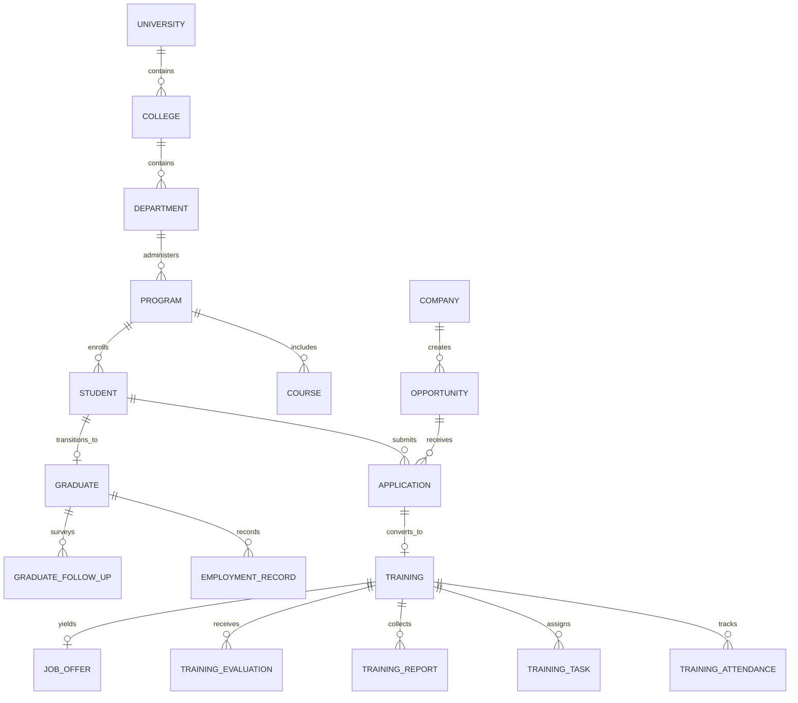

# Upvia Database Architecture & Data Models

## Executive Overview

Upvia is powered by **MongoDB** with **Mongoose ODM 8**, engineered for high write throughput, expressive aggregation pipelines, and schema validation.

The database is composed of **25+ Mongoose models**, divided across 6 core operational domains, linked via strict Object ID referencing and optimized with compound indexes.

---

## Entity Relationship Overview



---

## Core Domain Models

### 1. Identity, Access & Governance

#### `User`
- **Collection**: `users`
- **Fields**:
  - `email`: String (unique, indexed, trimmed, lowercased)
  - `passwordHash`: String (bcrypt hash)
  - `role`: Enum (15 roles defined in `UserRole`)
  - `firstNameEn`, `lastNameEn`: String
  - `firstNameAr`, `lastNameAr`: String
  - `phone`: String (optional)
  - `avatarUrl`: String (optional)
  - `isActive`: Boolean (default: `true`)
  - `lastLoginAt`: Date
- **Indexes**: `{ email: 1 }` (unique), `{ role: 1 }`, `{ isActive: 1 }`

#### `AuditLog`
- **Collection**: `audit_logs`
- **Fields**:
  - `action`: String (`CREATE`, `UPDATE`, `DELETE`, `STATUS_CHANGE`, `LOGIN`, `EVALUATE`)
  - `entity`: String (`USER`, `STUDENT`, `OPPORTUNITY`, `TRAINING`, etc.)
  - `entityId`: ObjectId (refers to the target entity)
  - `performedBy`: ObjectId (ref to `User`)
  - `ipAddress`: String
  - `userAgent`: String
  - `changes`: Map / Mixed (stores before/after delta)
  - `metadata`: Mixed
  - `timestamp`: Date (default: `Date.now`)
- **Indexes**: `{ entity: 1, timestamp: -1 }`, `{ performedBy: 1, timestamp: -1 }`

#### `Notification` & `NotificationPreference`
- Push and in-app alerts dispatched to users on key lifecycle events (offer received, evaluation due, early warning triggered).

---

### 2. Academic Infrastructure

#### `University`, `College`, `Department`, `Program`, `Batch`
- Hierarchical institutional structure representing university governance.
- **Key Fields**: `code`, `nameEn`, `nameAr`, parent references (`universityId`, `collegeId`, `departmentId`).
- Supports bilingual catalog representation.

#### `Course` & `StudyPlan`
- **Fields**: `code`, `nameEn`, `nameAr`, `credits`, `level`, `prerequisites` (array of Course refs), `programId`.
- Maps the academic prerequisites evaluated by the deterministic matching engine.

#### `Skill`
- Canonical skills taxonomy: `nameEn`, `nameAr`, `category` (`TECHNICAL`, `SOFT`, `LANGUAGE`, `DOMAIN`, `TOOL`), `description`.
- **Indexes**: `{ nameEn: 1 }`, `{ category: 1 }`

#### `AcademicSyncLog`
- Immutable logs for automated Student Information System (SIS) synchronization.
- **Fields**: `systemName`, `syncType`, `recordsProcessed`, `recordsFailed`, `status`, `syncErrors`, `startedAt`, `completedAt`.

---

### 3. Industrial Ecosystem

#### `Company`
- **Collection**: `companies`
- **Fields**:
  - `nameEn`, `nameAr`: String (indexed)
  - `commercialRegistrationNumber`: String (unique)
  - `sector`: Enum (`TECHNOLOGY`, `ENERGY`, `FINANCE`, `HEALTHCARE`, `GOVERNMENT`, `CONSULTING`, etc.)
  - `size`: Enum (`STARTUP`, `SME`, `ENTERPRISE`, `GOVERNMENT`)
  - `website`: String
  - `location`: `{ city: String, country: String, address: String }`
  - `status`: Enum (`PENDING_VERIFICATION`, `VERIFIED`, `SUSPENDED`, `REJECTED`)
  - `trainingToEmploymentRate`: Number (derived metric)
  - `averageRating`: Number (derived metric from student evaluations)
  - `studentsTrained`: Number
  - `studentsEmployed`: Number
- **Indexes**: `{ commercialRegistrationNumber: 1 }` (unique), `{ sector: 1 }`, `{ status: 1 }`

#### `Opportunity`
- **Collection**: `opportunities`
- **Fields**:
  - `companyId`: ObjectId (ref to `Company`)
  - `titleEn`, `titleAr`: String
  - `descriptionEn`, `descriptionAr`: String
  - `type`: Enum (`COOP_TRAINING`, `SUMMER_INTERNSHIP`, `FULL_TIME_JOB`, `PART_TIME`)
  - `status`: Enum (`DRAFT`, `SUBMITTED`, `UNDER_REVIEW`, `ACCREDITED`, `REJECTED`, `PUBLISHED`, `CLOSED`)
  - `requiredSkills`: Array of ObjectId (refs to `Skill`)
  - `preferredSkills`: Array of ObjectId (refs to `Skill`)
  - `eligiblePrograms`: Array of ObjectId (refs to `Program`)
  - `minGpa`: Number (e.g. `2.75` on 4.0 scale)
  - `location`: `{ city: String, isRemote: Boolean }`
  - `positionsCount`: Number
  - `availableSeats`: Number
  - `startDate`, `endDate`: Date
  - `stipend`: `{ amount: Number, currency: String }`
- **Indexes**: `{ status: 1, type: 1 }`, `{ companyId: 1 }`, `{ eligiblePrograms: 1 }`

---

### 4. Student & Application Pipeline

#### `Student`
- **Collection**: `students`
- **Fields**:
  - `userId`: ObjectId (ref to `User`, unique)
  - `studentIdNumber`: String (unique, institutional badge number)
  - `universityId`, `collegeId`, `departmentId`, `programId`: ObjectId refs
  - `batchId`: ObjectId (ref to `Batch`)
  - `gpa`: Number (0.00 to 4.00)
  - `completedCredits`: Number
  - `academicStanding`: Enum (`GOOD_STANDING`, `PROBATION`, `HONORS`)
  - `skills`: Array of ObjectId (refs to `Skill`)
  - `resumeUrl`: String
  - `trainingEligibility`: Enum (`NOT_ELIGIBLE`, `ELIGIBLE`, `IN_TRAINING`, `COMPLETED`)
  - `employmentStatus`: Enum (`UNEMPLOYED`, `SEEKING`, `EMPLOYED`, `PURSUING_HIGHER_EDUCATION`)
- **Indexes**: `{ studentIdNumber: 1 }` (unique), `{ programId: 1, gpa: -1 }`, `{ trainingEligibility: 1 }`

#### `Application` & `Interview`
- Tracks the full student hiring pipeline: `SUBMITTED` -> `UNDER_REVIEW` -> `SHORTLISTED` -> `INTERVIEW_SCHEDULED` -> `ACCEPTED` -> `OFFERED` -> `DECLINED`.
- Interviews store scheduled times, meeting links, interviewers, and candidate feedback notes.

---

### 5. Co-op Training Lifecycle

#### `Training` (Co-op Placement)
- **Collection**: `trainings`
- **Fields**:
  - `studentId`: ObjectId (ref to `Student`)
  - `companyId`: ObjectId (ref to `Company`)
  - `opportunityId`: ObjectId (ref to `Opportunity`)
  - `academicAdvisorId`: ObjectId (ref to `User`)
  - `companySupervisorId`: ObjectId (ref to `User`)
  - `status`: Enum (`PENDING_APPROVAL`, `ACTIVE`, `COMPLETED`, `TERMINATED`, `DROPPED`)
  - `startDate`, `endDate`: Date
  - `totalRequiredHours`: Number (default: `480` hours)
  - `completedHours`: Number (computed from approved attendance)
  - `attendanceRate`: Number (percentage)
  - `supervisorEvaluationScore`: Number (0 to 100)
  - `studentEvaluationScore`: Number (0 to 100)
  - `finalGrade`: String (`A+`, `A`, `B+`, `PASS`, etc.)
- **Indexes**: `{ studentId: 1 }`, `{ companyId: 1, status: 1 }`, `{ status: 1 }`

#### `TrainingAttendance`, `TrainingTask`, `TrainingReport`
- **Attendance**: Date, checkIn time, checkOut time, totalHours, status (`PRESENT`, `ABSENT`, `EXCUSED`), approval status.
- **Tasks**: Title, description, due date, deliverable URL, status (`ASSIGNED`, `IN_PROGRESS`, `SUBMITTED`, `APPROVED`).
- **Reports**: Weekly/monthly reports written by students, supervisor comments, coordinator approvals.

#### `TrainingEvaluation` & `CompanyEvaluation`
- **TrainingEvaluation** (Supervisor evaluates Student): 10-dimension rubric:
  1. Professionalism & Punctuality
  2. Technical Competence
  3. Problem Solving
  4. Team Collaboration
  5. Communication Skills
  6. Initiative & Proactivity
  7. Adaptability
  8. Quality of Work
  9. Ethical Conduct
  10. Overall Employability Potential
- **CompanyEvaluation** (Student evaluates Placement): 7-dimension workplace rubric:
  1. Mentorship Quality
  2. Meaningful Work Assignments
  3. Workplace Safety & Culture
  4. Resources & Equipment Provided
  5. Feedback Frequency
  6. Skill Development
  7. Would Recommend to Peers

#### `JobOffer`
- Tracks formal employment offers extended by companies to high-performing trainees.
- **Fields**: `studentId`, `companyId`, `trainingId`, `positionTitle`, `salary`, `status` (`OFFERED`, `ACCEPTED`, `DECLINED`, `EXPIRED`).

---

### 6. Longitudinal Tracking, Analytics & Quality Assurance

#### `Graduate`, `GraduateFollowUp`, `EmploymentRecord`
- **Graduate**: Enrolls students post-graduation, graduation term, honors, initial status.
- **GraduateFollowUp**: Scheduled check-ins at 3, 6, 12, and 24 months post-graduation.
- **EmploymentRecord**: Company, job title, start date, salary range, relevance to major (`DIRECTLY_RELATED`, `SOMEWHAT_RELATED`, `UNRELATED`).

#### `SkillGap`
- Dynamically calculated program-level deficit comparing industry job postings against curriculum learning outcomes.
- **Fields**: `programId`, `skillId`, `marketDemandFrequency`, `curriculumCoveragePercent`, `gapSeverity` (`HIGH`, `MEDIUM`, `LOW`), `recommendedAction`.

#### `AlertRule` & `Alert`
- Institutional quality assurance engine detecting low placement rates, attendance drops below 80%, supervisor evaluation delays, and company SLA breaches.

---

## Indexing Strategy

All models utilize targeted single and compound indexes:
```typescript
// Student query optimization: find eligible students in a program by GPA
StudentSchema.index({ programId: 1, trainingEligibility: 1, gpa: -1 });

// Opportunity query optimization: active opportunities filtered by program and type
OpportunitySchema.index({ status: 1, type: 1, eligiblePrograms: 1 });

// Training query optimization: active student placement
TrainingSchema.index({ studentId: 1, status: 1 });

// Audit query optimization: recent actions by entity
AuditLogSchema.index({ entity: 1, timestamp: -1 });
```
