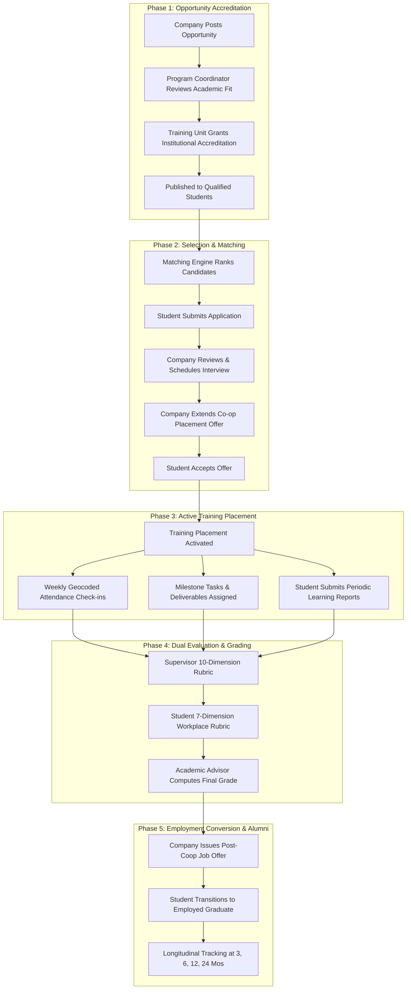

# Upvia Cooperative Training (Co-op) Lifecycle Workflow

## Lifecycle Overview

Cooperative training (Co-op) is an intensive, academic-credit-bearing field placement requiring rigorous coordination between universities and industrial employers.

Upvia standardizes this pipeline into **5 auditable phases**, preventing administrative bottlenecks and ensuring compliance with national accreditation criteria.

---

## 5-Phase Co-op Lifecycle Diagram

---

## Detailed Phase Breakdown

### Phase 1: Accreditation & Institutional Governance
1. **Employer Submission**: The corporate partner (`COMPANY_ADMIN`) creates a training requisition specifying title, job description, required skills, supervisor details, city, and seats.
2. **Coordinator Verification**: The relevant `PROGRAM_COORDINATOR` verifies that the internship scope aligns with degree program learning outcomes (ABET/NCAAA standards).
3. **Training Unit Accreditation**: The `TRAINING_UNIT_HEAD` verifies company credentials, safety compliance, and activates the listing.

### Phase 2: Explainable Application & Match Pipeline
1. **Targeted Discovery**: Qualified students discover accredited opportunities with deterministic match scores calculated against their SIS profiles.
2. **Application Submission**: Students apply with their institutional profile, verified GPA, and uploaded portfolio.
3. **Interview Workflow**: Corporate recruiters shortlist applicants and schedule interviews directly in the portal.
4. **Offer & Acceptance**: Upon receiving a co-op offer, student acceptance automatically triggers training record generation and closes competing applications.

### Phase 3: Active Training Supervision
1. **Attendance Tracking**: Students log daily check-in and check-out timestamps. Field supervisors review and verify weekly attendance logs.
2. **Task & Milestone Management**: Supervisors create project deliverables with deadlines. Students upload artifacts and receive feedback.
3. **Student Learning Reports**: Bi-weekly or monthly reflective journals are submitted by the student and reviewed by their assigned university `TRAINING_SUPERVISOR`.

### Phase 4: Rigorous Dual Evaluation
1. **Supervisor Evaluation (10 Dimensions)**:
   Field supervisors assess student performance across 10 critical competencies:
   - Professionalism & Punctuality
   - Technical Competence
   - Problem-Solving Capacity
   - Team Collaboration
   - Communication Skills
   - Initiative & Proactivity
   - Adaptability & Learning Curve
   - Quality of Deliverables
   - Ethical Conduct
   - Overall Full-Time Employability Potential
2. **Student Workplace Evaluation (7 Dimensions)**:
   Trainees provide confidential feedback on their placement environment:
   - Mentorship and Guidance Quality
   - Meaningful Work Assignments
   - Workplace Culture & Safety
   - Hardware and Software Tools Provided
   - Constructive Feedback Frequency
   - Technical Skill Enhancement
   - Likelihood to Recommend Company to Peers

### Phase 5: Post-Training Job Offers & Graduate Transition
1. **Fast-Track Hiring**: High-performing trainees receive direct post-graduation job offers from the host employer prior to graduation.
2. **Longitudinal Follow-up**: The university career tracking engine surveys the cohort at 3, 6, 12, and 24-month intervals to measure career retention, salary trajectories, and industrial impact.
